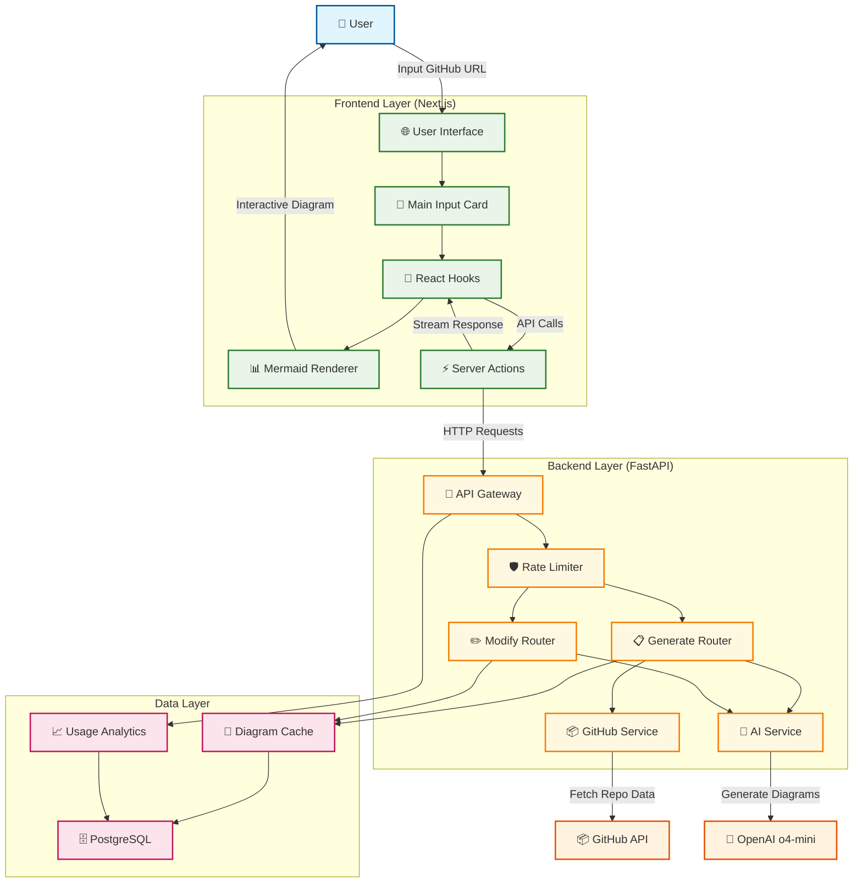
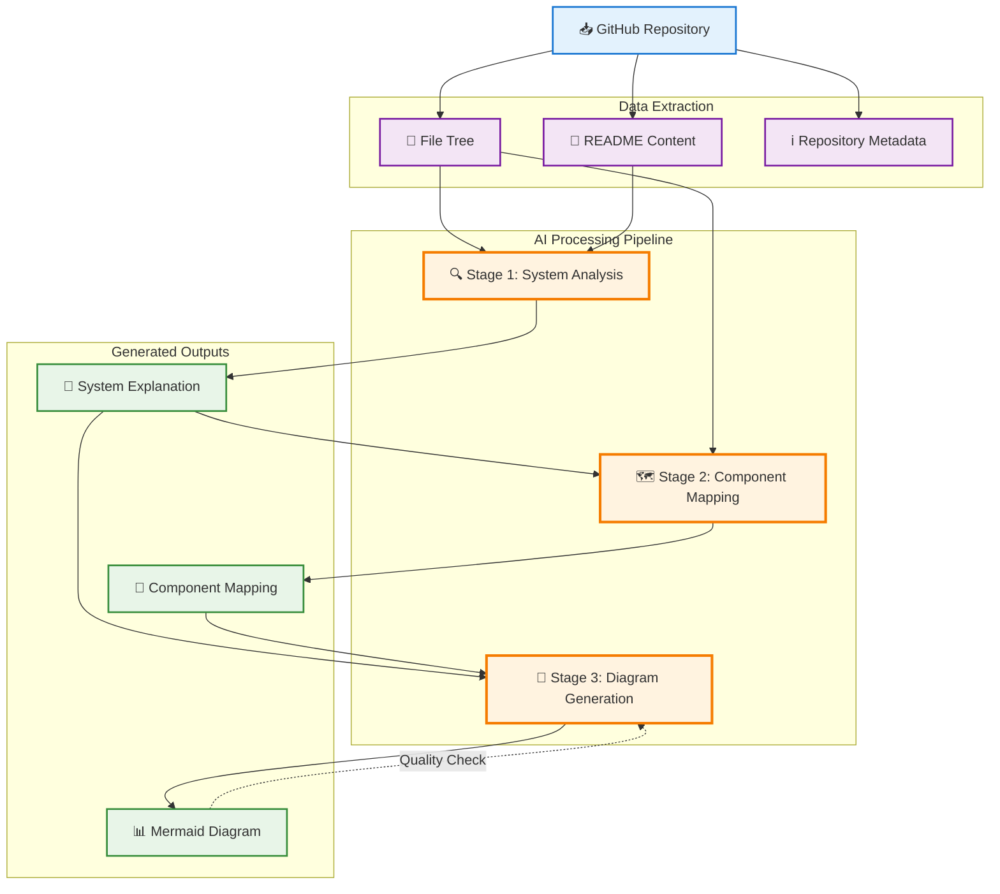
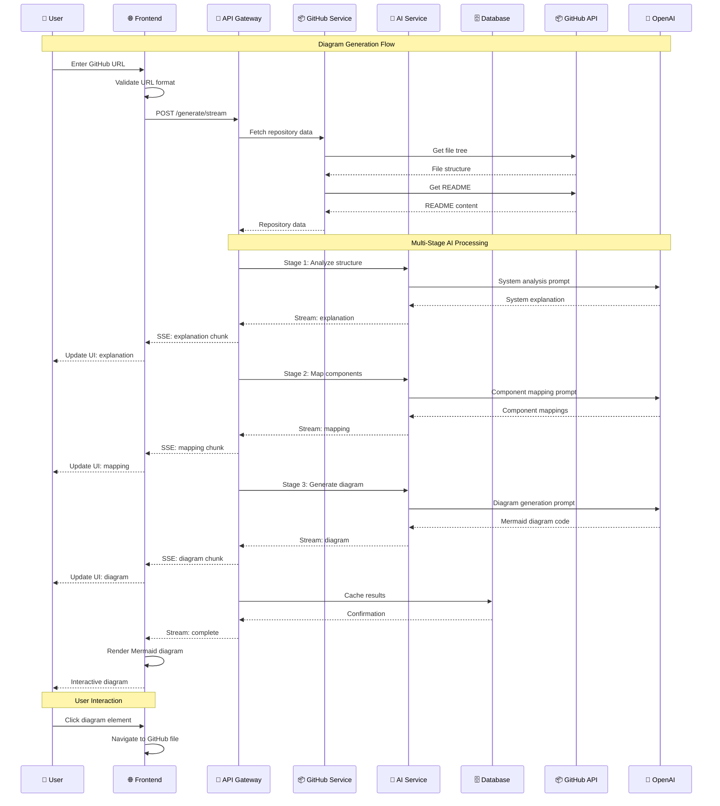
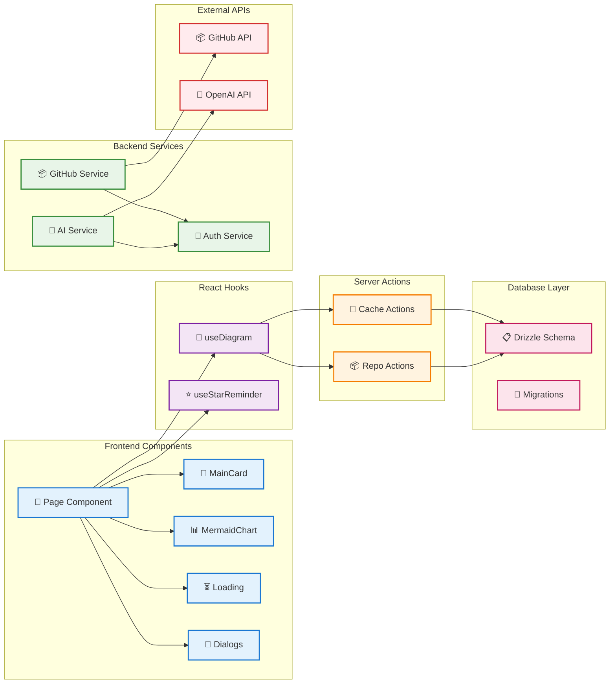
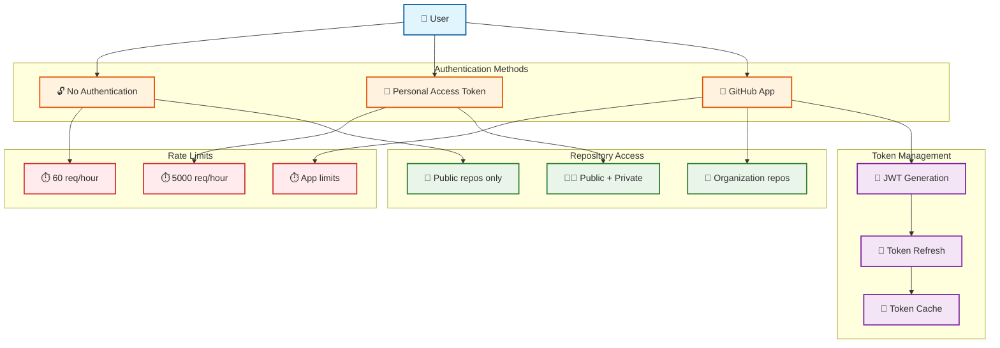
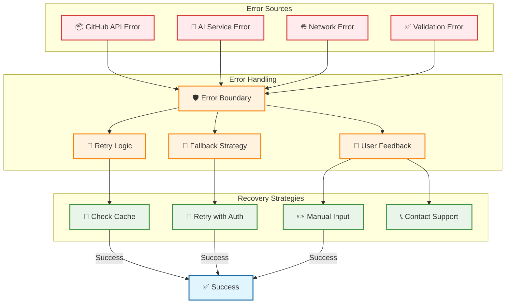
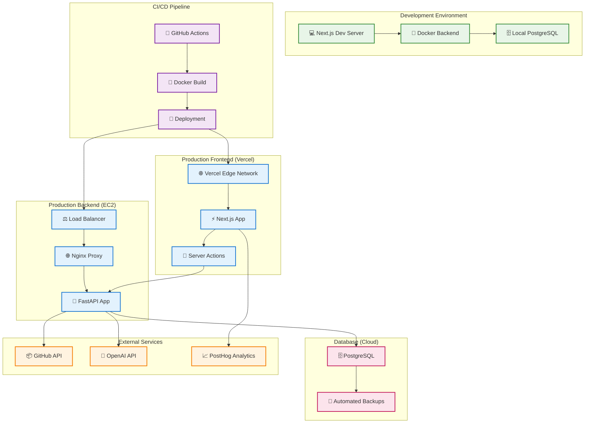

# GitDiagram System Architecture Diagrams

## 1. High-Level System Architecture

## 2. AI Processing Pipeline

## 3. Data Flow Sequence

## 4. Component Architecture

## 5. Authentication Flow

## 6. Error Handling & Recovery

## 7. Deployment Architecture

These diagrams provide a comprehensive visual overview of the GitDiagram system architecture, from high-level component relationships to detailed data flows and deployment strategies.