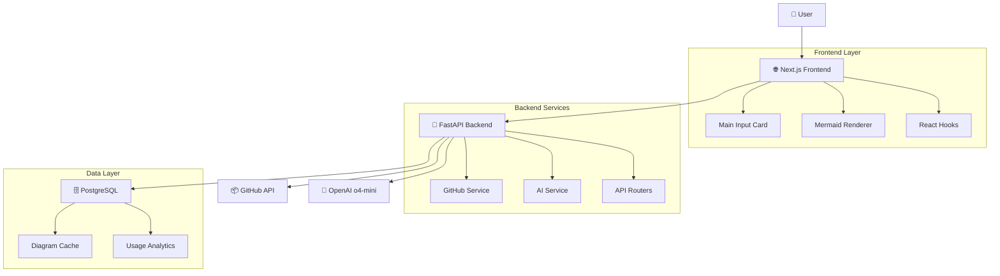
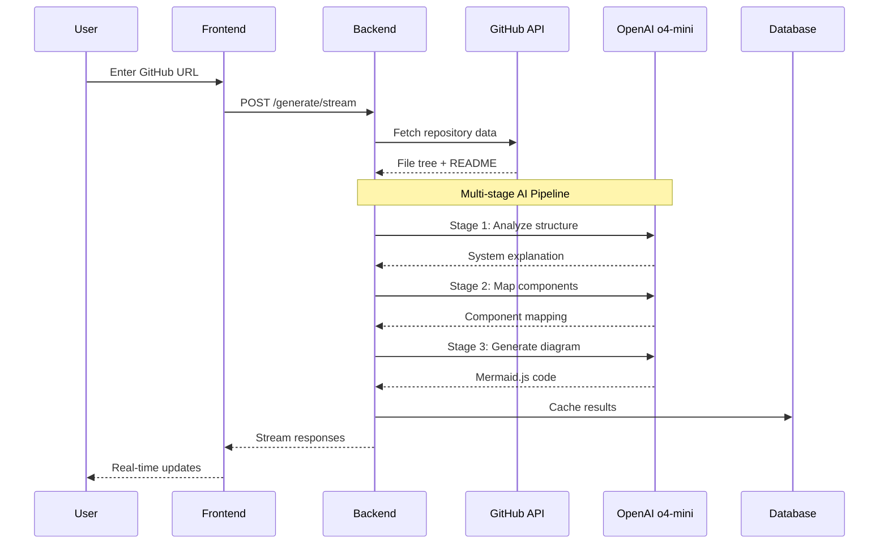

# GitDiagram System Architecture Analysis

## Overview

GitDiagram is a sophisticated web application that transforms GitHub repositories into interactive Mermaid.js diagrams. The system employs a multi-stage AI pipeline to analyze repository structure and generate meaningful architectural visualizations.

## System Architecture

### High-Level Architecture



## Core Components

### 1. Frontend (Next.js + TypeScript)

**Location**: `/src/`

**Key Components**:
- **Main Card** (`main-card.tsx`): Primary user interface for repository input
- **Mermaid Chart** (`mermaid-diagram.tsx`): Interactive diagram renderer with zoom/pan
- **Diagram Hook** (`useDiagram.ts`): State management for diagram generation
- **API Actions** (`_actions/`): Server-side data operations

**Notable Patterns**:
- ✅ **Excellent**: Clean separation of concerns with custom hooks
- ✅ **Excellent**: Server Actions for database operations
- ✅ **Excellent**: Real-time streaming UI updates
- ✅ **Excellent**: Progressive enhancement with dynamic imports

### 2. Backend (FastAPI + Python)

**Location**: `/backend/app/`

**Key Services**:
- **GitHub Service** (`services/github_service.py`): Repository data fetching
- **OpenAI Service** (`services/o4_mini_openai_service.py`): AI model integration
- **API Routers** (`routers/`): RESTful endpoints
- **Prompt Engineering** (`prompts.py`): Multi-stage AI pipeline

**Architecture Highlights**:
- ✅ **Excellent**: Multi-stage prompt engineering pipeline
- ✅ **Excellent**: Flexible authentication (GitHub App + PAT)
- ✅ **Excellent**: Streaming responses for real-time feedback
- ✅ **Excellent**: Comprehensive error handling

### 3. Database Layer (PostgreSQL + Drizzle ORM)

**Location**: `/src/server/db/`

**Schema Design**:
```typescript
diagramCache {
  username: string (PK)
  repo: string (PK)
  diagram: string
  explanation: string
  createdAt: timestamp
  updatedAt: timestamp
  usedOwnKey: boolean
}
```

## Data Flow Architecture

### 1. Diagram Generation Pipeline



### 2. Three-Stage AI Pipeline

**Stage 1: System Analysis**
- Input: File tree + README
- Output: Detailed architectural explanation
- Purpose: Understanding project structure and purpose

**Stage 2: Component Mapping**
- Input: Explanation + File tree
- Output: Component-to-file/directory mappings
- Purpose: Enable interactive clickable elements

**Stage 3: Diagram Generation**
- Input: Explanation + Mappings
- Output: Mermaid.js diagram code
- Purpose: Visual representation with interactivity

## Exceptional Design Patterns

### 1. 🌟 Multi-Stage Prompt Engineering

**Location**: `backend/app/prompts.py`

**Why Exceptional**:
- Separates concerns: analysis → mapping → visualization
- Reduces token costs while maintaining accuracy
- Enables progressive enhancement of diagram quality
- Each stage has focused, optimized prompts

**Adaptable Pattern**:
```python
# Stage-based AI pipeline pattern
def stage_1_analyze(input_data):
    return ai_service.call(ANALYSIS_PROMPT, input_data)

def stage_2_map(analysis, raw_data):
    return ai_service.call(MAPPING_PROMPT, {"analysis": analysis, "data": raw_data})

def stage_3_generate(analysis, mapping):
    return ai_service.call(GENERATION_PROMPT, {"analysis": analysis, "mapping": mapping})
```

### 2. 🌟 Streaming Response Architecture

**Location**: `backend/app/routers/generate.py`, `src/hooks/useDiagram.ts`

**Why Exceptional**:
- Real-time user feedback during long AI operations
- Graceful handling of network interruptions
- Progressive UI updates with state management
- Excellent UX for time-intensive operations

**Frontend Pattern**:
```typescript
// Streaming state management pattern
const [state, setState] = useState<StreamState>({ status: "idle" });

const processStream = async () => {
  const reader = response.body?.getReader();
  while (true) {
    const { done, value } = await reader.read();
    if (done) break;
    
    const chunk = new TextDecoder().decode(value);
    const lines = chunk.split('\n');
    
    for (const line of lines) {
      if (line.startsWith('data: ')) {
        const data = JSON.parse(line.slice(6));
        setState(prev => ({ ...prev, ...data }));
      }
    }
  }
};
```

### 3. 🌟 Flexible Authentication Strategy

**Location**: `backend/app/services/github_service.py`

**Why Exceptional**:
- Supports multiple auth methods: GitHub App, PAT, unauthenticated
- Graceful degradation with rate limit warnings
- Automatic token refresh for GitHub Apps
- User-provided PAT for private repositories

### 4. 🌟 Interactive Diagram Generation

**Location**: `backend/app/prompts.py` (click events), `src/components/mermaid-diagram.tsx`

**Why Exceptional**:
- AI generates clickable elements that link to actual code
- Seamless integration between AI output and GitHub URLs
- Dynamic zoom/pan functionality
- Progressive enhancement with SVG manipulation

### 5. 🌟 Cost-Aware Architecture

**Location**: `backend/app/routers/generate.py`

**Why Exceptional**:
- Pre-generation cost estimation
- Token counting and optimization
- Caching to reduce redundant API calls
- User choice between free and paid tiers

## Areas for Improvement

### 1. ⚠️ Potential Anti-Patterns

**Large Prompt Files**:
- `prompts.py` contains very long prompt strings
- **Suggestion**: Extract to separate template files with variable substitution

**Frontend State Complexity**:
- `useDiagram.ts` manages complex streaming state
- **Suggestion**: Consider state machine pattern (XState)

**Hardcoded Configuration**:
- Some limits and settings are hardcoded
- **Suggestion**: Move to environment-based configuration

### 2. 🔧 Enhancement Opportunities

**Error Recovery**:
- Limited retry mechanisms for failed AI calls
- **Suggestion**: Implement exponential backoff and circuit breaker patterns

**Caching Strategy**:
- Simple database caching only
- **Suggestion**: Add Redis for session-based caching and rate limiting

**Monitoring & Observability**:
- Basic analytics only
- **Suggestion**: Add structured logging, metrics, and tracing

## Technology Stack Assessment

### Frontend Excellence
- ✅ **Next.js 15**: Latest features with App Router
- ✅ **TypeScript**: Full type safety
- ✅ **Tailwind CSS**: Utility-first styling
- ✅ **ShadCN**: High-quality component library
- ✅ **Drizzle ORM**: Type-safe database operations

### Backend Excellence
- ✅ **FastAPI**: Modern Python web framework
- ✅ **Pydantic**: Data validation and serialization
- ✅ **Streaming Responses**: Real-time user feedback
- ✅ **Rate Limiting**: SlowAPI integration
- ✅ **CORS Configuration**: Proper security setup

### Infrastructure
- ✅ **Docker**: Containerized backend
- ✅ **PostgreSQL**: Reliable data persistence
- ✅ **Vercel**: Optimized frontend deployment
- ✅ **GitHub Actions**: CI/CD pipeline

## Adaptable Patterns for Other Projects

### 1. Multi-Stage AI Pipeline
```python
class AIStageProcessor:
    def __init__(self, stages: List[AIStage]):
        self.stages = stages
    
    async def process(self, initial_input):
        result = initial_input
        for stage in self.stages:
            result = await stage.process(result)
        return result
```

### 2. Streaming Response Handler
```typescript
class StreamProcessor {
  async processStream(response: Response, onUpdate: (data: any) => void) {
    const reader = response.body?.getReader();
    const decoder = new TextDecoder();
    
    while (true) {
      const { done, value } = await reader.read();
      if (done) break;
      
      const chunk = decoder.decode(value);
      this.parseAndEmit(chunk, onUpdate);
    }
  }
}
```

### 3. Flexible Authentication
```python
class AuthStrategy:
    def get_headers(self) -> Dict[str, str]:
        raise NotImplementedError

class GitHubAppAuth(AuthStrategy):
    def get_headers(self) -> Dict[str, str]:
        token = self._get_installation_token()
        return {"Authorization": f"Bearer {token}"}

class PATAuth(AuthStrategy):
    def get_headers(self) -> Dict[str, str]:
        return {"Authorization": f"token {self.pat}"}
```

## Conclusion

GitDiagram demonstrates exceptional software engineering practices, particularly in:

1. **AI Pipeline Architecture**: Multi-stage processing for optimal results
2. **Real-time User Experience**: Streaming responses with progressive updates
3. **Flexible Authentication**: Multiple GitHub auth strategies
4. **Interactive Visualizations**: AI-generated clickable diagrams
5. **Cost Optimization**: Token counting and caching strategies

The codebase serves as an excellent reference for building AI-powered applications with real-time feedback, complex data processing pipelines, and interactive visualizations.